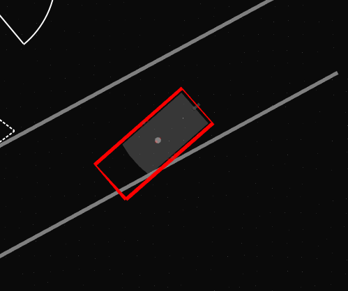
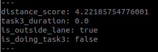
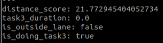
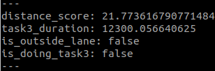

# aichallenge_scoring

This package is responsible for tasks that are necessary for the scoring and ranking of participants of the AI Challenge.

It consists of the following features:

- Calculates the distance_score of the vehicle.
- Checks whether the current vehicle footprint is inside the lanelet.
- Measures the time it takes for the vehicle to complete Task 3 of the AI Challenge 2023 tasks.

## How to run

```
$ cd ws
$ mkdir tmp
$ vcs import tmp < test.repos
$ rosdep install -y --from-paths src --ignore-src --rosdistro $ROS_DISTRO -r
$ colcon build --symlink-install --cmake-args -DCMAKE_BUILD_TYPE=Release --packages-up-to aichallenge_scoring
```

```
$ ros2 launch aichallenge_scoring aichallenge_scoring.launch.xml
```

## Interface

### Input

- /localization/kinematic_state [`nav_msgs::msg::Odometry`]
- /map/vector_map [`autoware_auto_mapping_msgs::msg::HADMapBin`]

### Output

- output/footprint_marker [`visualization_msgs::msg::Marker`] : Vehicle footprint visualization
- output/score [`aichallenge_scoring_msgs::msg::Score`] : Resulting score

## Parameters

### Node Parameters

| Name                  | Type   | Description                           | Default value |
| :-------------------- | :----- | :------------------------------------ | :------------ |
| task1_start_distance  | double | Distance of the start line for Task 3 | 10.0          |
| task1_end_distance    | double | Distance of the end line for Task 3   | 20.0          |
| task3_start_distance  | double | Distance of the start line for Task 3 | 10.0          |
| task3_end_distance    | double | Distance of the end line for Task 3   | 20.0          |

## Visualization

The vehicle footprint calculated in this node can be visualized by displaying the `output/footprint_marker` topic in Rviz2.

When the vehicle footprint is inside the lane, the polygon is shown in green.


when the vehicle footprint leaves the lane, the polygon turns red.



# aichallenge_scoring_msgs

## Message Definition

| Name                  | Type   | Description |
| :-------------------- | :----- | :------------- |
| distance_score | double | Distance Score (as defined in the competition) (meters) |
| task3_duration    | double | Duration of time it took to complete Task 3 (seconds) |
| is_stopped | bool | Returns `true` while ego-vehicle is stationary |
| is_outside_lane | bool | Returns `true` while ego-vehicle is outside lane|
| is_doing_task3 | bool | Returns `true` while ego-vehicle is in the middle of doing Task 3|
| has_finished_task1 | bool | Returns `true` once Task 1 is completed |
| has_finished_task2 | bool | Returns `true` once Task 2 is completed |
| has_finished_task3 | bool | Returns `true` once Task 3 is completed |

## How the score output can be processed

- At any point during the run, if the ego-vehicle leaves the lane for even a moment (if `is_outside_lane` returns `true` even once), then the `distance_score` is recorded for that moment and the run is over.
- If ego-vehicle completes Task 3 (`has_finished_task3` returns `true`), then the `distance_score` and `task3_duration` for that moment is recorded.


## Examples of the score output

The score topic `output/score` shows output like the ones below.

When the vehicle leaves the lane, the `is_outside_lane` shows `true`.




When the vehicle enters the Task 3 area defined by the `task3_start_distance` and `task3_end_distance` parameters, the `is_doing_task3` is set to `true`.



After Task 3 is finished, the `is_doing_task3` returns back to `false`, and the `task3_duration` is filled in with the time it took for Task 3 to be completed in milliseconds.


