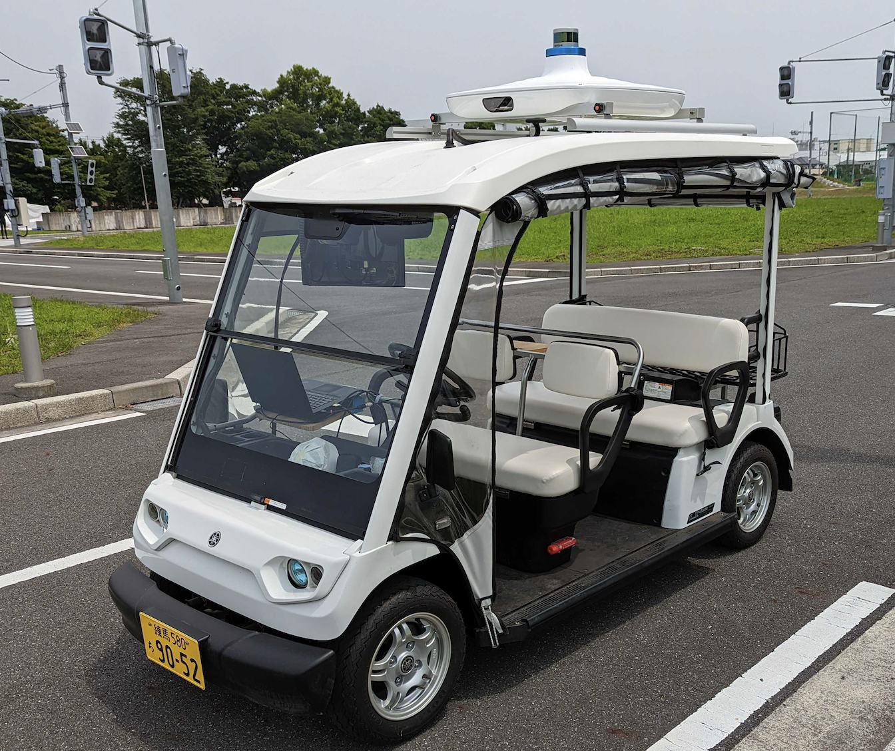

# 決勝大会について

<br>

## はじめに
決勝大会では競技参加者の開発用ノートパソコンでゴルフカート型の自動運転車両を走行させ、開発した自動運転ソフトウェアの性能を競います。競技参加者の皆様には、開発用ノートパソコンの車両への接続から自動運転走行開始までの操作を実施していただきます。

<br>

> [!Video https://www.youtube.com/embed/8oF-XcbsJes?si=mD5LQWd28DEj5L7L]

<br>

<div align="center">
  

  _走行の様子_<br>
  （引用: https://www.jsae.or.jp/jaaic2022/final.html "競技解説 Explanation of　the competition"）
</div>


<br>

## 日程について
詳細は10月公開予定となっております。

- 場所：柏の葉キャンパス
- 事前準備：11/9(木),11/11(土)
- 決勝：11/12(日): 8:30集合~17:00解散
<br>

### スケジュール
- 場所: 東京大学柏の葉キャンパス
- 事前練習会:
  - 11/09(木) 12:00 ~
  - 11/11(土) 09:00 ~  
※どちらかの日程に参加していただきます。各チームの参加日は、居住地やアンケートなどを踏まえ、後日大会運営から連絡いたします。
- 決勝大会: 
  - 11/12(日) 08:00 ~ 17:00頃  
※集合時間や競技出場時間については後日大会運営から連絡いたします。

## 本番当日までの流れ

1. **課題3 開発:** 予選大会で開発したソフトウェアをベースに、大会運営から提供するデータを活用し、課題3のクリア、タイム短縮に向けさらなる開発を加えていただきます。
2. **課題2 開発:** 大会運営から提供する実験データを用いて課題２(煙への対応)に取り組んでいただきます。
3. **事前練習会:** 自動運転車両のオペレーションの取得と、開発したソフトウェアの動作確認をしていただきます。
4. **本番当日:** 自動運転車両を走行させ、各課題に挑戦していただきます！

***課題2, 課題3: 開発用の実験データについて***  
本選を模擬した環境で測定したrosbagデータを提供しています。  
rosbagデータは以下のリンクからダウンロード可能です。
- [開発用rosbagデータ ダウンロードリンク](https://tier4inc-my.sharepoint.com/:f:/g/personal/taiki_tanaka_tier4_jp/EhYPKmgfAmtNkQ0HpHc-2GcB0WRbmNOmlf410XjH4LmpRQ?e=h0vE5l)

***事前練習会について***  
事前練習会では、開発用ノートパソコンの車両への接続から自動運転走行開始までの操作を実施していただきます。本トレーニングは一部の競技コースの走行を含むため、競技で使用する実車のデータを取得し、開発したソフトウェアの動作確認をしていただくことが可能です。

## 競技車両について

<br>

<div align="center">
  

  _競技に使用する車両_
</div>

<br>

- 競技に使用する車両は予選のE2E空間で操作した車両と同様のセンサー(LiDAR)を備えています。一方で車両の運動特性は、シミュレーションのモデルと同一ではありません。
- LiDARに繋がるネットワークインターフェースとCANインターフェースを備えています。開発用ノートパソコンをこれらに接続することで自動運転走行を実施します。
- 競技に使用する車両にはメンターと、セーフティドライバーが同乗します。メンターはインターフェースの接続や、自動運転ソフトウェア操作のサポートを、セーフティドライバーは手動運転での車両の移動と、自動運転走行時の監視を行います。
- 車両の制御モードには、`自動モード`と`手動モード`の2種類があり、セーフティードライバーの操作により切り替えることができます。
- 自動運転走行中、セーフティードライバーはブレーキをかけることで、車両の制御モードを`自動モード`から`手動モード`に切り替えることができます。これをオーバーライドといいます。セーフティドライバーは自動運転を継続することが危険と判断された場合にオーバーライドを実施します。

## 決勝大会用PCでのソースコードのビルド方法

決勝大会用PCでは，dockerではなく，ローカルでソースコードをビルドすることを想定しています．
依存関係のインストール・ソースコードのビルドには，以下のコマンドを実行してください．

```bash
cd /home/autoware/aichallenge2023-integration-final

rosdep install -y --from-paths src --ignore-src --rosdistro $ROS_DISTRO
colcon build --symlink-install --cmake-args -DCMAKE_BUILD_TYPE=Release
```

## 決勝大会参加者向け 事前確認事項 (2023/09/28 追記)

決勝大会参加者の皆様は大会当日までに以下を十分に確認してください。

### 参加チームのサポート体制

各チームにはTIERIV及びMAPIVから、セーフティドライバー(SD)、メンター兼セーフティオペレータ(SO)、がサポートとして同乗します。

- SD（セーフティドライバー）の役割
SDの役割は、手動運転によるゴルフカートの移動と、自動運転中の車両監視です。  
**SDは自動運転の監視経験が豊富なスタッフが担当いたします。オーバーライドが実施された場合は、SDの判断の尊重をお願いたします。**

- メンター兼SO（セーフティオペレータ）の役割
SOは参加者のメンターとして活動する一方、自動運転の監視を行います。  
**自動運転走行の継続が危険とSOが判断した緊急、SOは緊急停止ボタンを操作する責任を持っています。緊急停止ボタンが押下された場合は、SOの判断の尊重をお願いいたします。**

### 事前のシミュレーション実施のお願い

**安全な競技運営のため、来場前にPlannning Simulationの実施をお願いいたします。**
*Planning Simulation 実施方法*  

1. ターミナルを開き、以下のコマンドを実行する
    配布したPCを持っている方は以下のコマンドを、配布したPCを持っていない方で練習したい方は車両モデルを配布可能なモデルに置き換えるため[こちら](https://github.com/AutomotiveAIChallenge/aichallenge2023-integration-final/blob/178f9a05d77560f51df4bde915d15c6300f1d99a/scripts/vars/vehicle.env#L1)の`export VEHICLE_MODEL=golfcart`に置き換えてください
    ```bash
    source /home/autoware/aichallenge2023-integration-final/install/setup.bash
    cd /home/autoware/aichallenge2023-integration-final/scripts
    ./launch_psim.sh

    ```

2. `2D Pose Estimation` を使用し、スタート地点に車両を配置する
3. 新たにターミナルを開き、スクリプト   `~/aichallenge2023-integration-final/scripts/set_obstacles.sh` を実行する。その後、課題3の障害物が再現されていることを確認する。 ※スクリプトが存在しない場合は、[こちらのコミット](https://github.com/AutomotiveAIChallenge/aichallenge2023-integration-final/commit/49ec129db8f26485fffed7daef85c5da1649998b)を取り入れてください。
4. ゴールを設定し、自動運転走行を開始する。
5. 車両が危険な挙動 (制限速度を超過した走行、障害物を無視した走行) をしないことを確認する。

Planning Simulationについての詳細は [Autoware Documentation](https://autowarefoundation.github.io/autoware-documentation/main/tutorials/ad-hoc-simulation/planning-simulation/) を参照してください。

### 天候条件に関する基準

- 風速5m/s以上の場合、煙を使用した課題2は取りやめとします。
- 11/12の本番が雨天であれば本番は11/19に振り替える予定です。
- 上記の通り予備日を設けて公平性に配慮していますが、練習日が雨天の場合は事前練習ができない場合がございますので予めご了承ください。

### 競技の公平性に関するお知らせ

- 車両の特性について  
提供する車両は、センサーの位置やステアオフセットなどの調整がTIERIVでのチューニング時に既に完了しています。参加者側での追加の調整は問題ございません。  
- 煙に関する取り扱い
本大会は工場内搬送をテーマに設定しており、煙の中でも安定した走行ができることを目指しております。屋外環境において特殊環境を再現しようとしています為、走行のタイミングによって環境の差異が発生します。ご了承ください。

### 追加機能と地図の更新について

- 車両がコース外に逸脱した場合、自動的に走行が中断（Disengage）される機能が追加されました。
- 実機での実験の結果を踏まえ、地図を更新しました。地図データ入れ替えのご対応をおねがいいたします。新しい地図データは[こちらのSlackリンク](https://aichallenge2023-integ.slack.com/files/U05CFHNAZ8B/F05U4K4QMBJ/lanelet2_map.osm)からアクセス可能です。
  