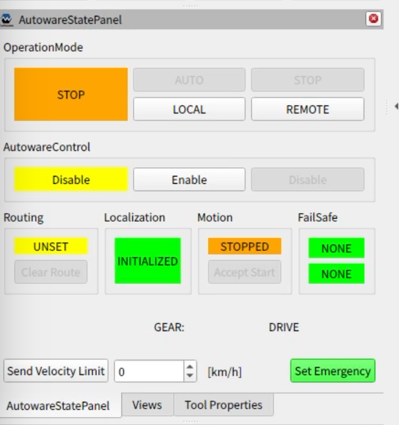
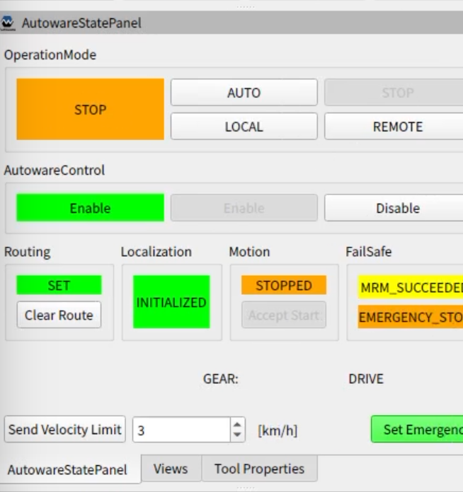
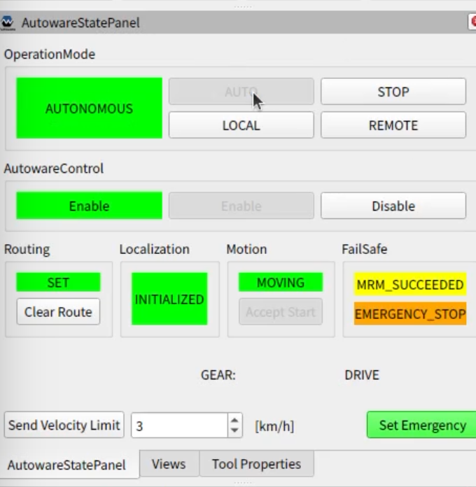

# Operation (決勝大会)

**注意: このページは作成中です。ページの内容は暫定の情報であり、今後変更される可能性があります。**

このページでは、 AutowareをインストールしたノートPCで競技車両(自動運転対応ゴルフカート、以下ゴルフカート)を動かす手順を解説します。

※開発用のレポジトリが`/home/autoware/aichallenge2023-integration-final`に配置されている前提で解説しています。


## 自動運転開始までの手順

このセクションでは、競技の参加者の皆様が開発用ノートパソコンを車両に接続した後、自動運転を開始するまでのフローを説明します。

**※車両を動かす前に必ず [安全に関する注意点](#安全に関する注意点)を一読ください。**

1. (競技参加者)ターミナルを開き、以下のコマンドを実行してAutowareを起動する。
    ```
    $ cd ~/aichallenge2023-integration-final/scripts
    $ ./run_autoware_on_vehicle.sh
    ```

2. (競技参加者)自己位置推定を開始する。
   1. 2D pose estimate をrVizから入力する。
   2. `AutowareStatePanel` の `Localization`の表示が`INITIALIZED`となっていることを確認する。
   

3. (競技参加者)ゴール地点を指定する。
   1. ターミナルを開き、`~/aichallenge2023-integration-final/scripts/set_goal.sh`を実行してゴール地点を設定する。
   2. ゴールに向かう経路が引かれていることをrVizで確認する。

4. (セーフティドライバー)ゴルフカートのモードを`自動モード`に設定する。

5. (競技参加者)Autowareによる車両制御を有効化する。
   1. メンターの指示を受け、`AutowareStatePanel`の`AutowareControl`の`Enable`ボタンをクリックする。
   2. `AutowareStatePanel`の`AutowareControl`の表示が`Enable`になっていることを確認する。
   

6. (セーフティードライバー) ステアの挙動を確認し、ゴルフカードがAutowareの制御を正常に受け付けていることを確認し、Autowareの自動運転モード許可を参加者に伝達する。

7. (競技参加者)Autowareを自動運転モードに設定する。
   1. セーフティドライバーに「自動運転開始します」と発話する。
   2. `AutowareStatePanel`の`OperationMode`の`AUTO`ボタンをクリックする。
   3. `AutowareStatePanel`の`OperationMode`の表示が`AUTONOMOUS`になっていることを確認する。
   

### オーバーライド（ドライバーが車両を停止させたとき）が発生した場合
自動運転中に縁石への乗り上げや、障害物への接触が予見される場合はセーフティードライバーがブレーキをかけ、車両の制御を自動運転から手動運転に切り替えます。これをオーバーライドといいます。
課題1、 課題2、課題3-1の区間でセーフティードライバーがオーバーライドを行った場合は、以下の手順を経て、次の課題から開始します。
1. (セーフティドライバー) オーバーライドした旨を競技参加者に伝達する。
2. (セーフティドライバー) ゴルフカートのモードを`手動モード`に設定する。
3. (セーフティドライバー) 次の課題のスタート地点へ車両を移動する。
4. メンターの指示を受け、`AutowareStatePanel`の`AutowareControl`の`Disable`ボタンをクリックする。
5. `AutowareStatePanel`の`AutowareControl`の表示が`Disable`になっていることを確認する。
6. [自動運転開始までの手順](#自動運転開始までの手順) 4番、 **(セーフティドライバー)ゴルフカートのモードを`自動モード`に設定する。** から再開する。

## 安全に関する注意点

- HWの接続不良などが原因で、自動運転モードへの切り替えに失敗することがあります。自動運転モードへの切り替え失敗はセーフティドライバーが判断します。本事象が発生した場合は、メンターの指示に従い自動運転開始までの手順をやり直してください。
- 自動運転走行時、車両に同乗しない参加者は歩道上で待機してください。経路上や車両周囲は立ち入り禁止です。
- 自動運転走行時は必ず上部の手すりを掴んでください。
- 自動運転に使用するノートPCをバンドで固定してください。 キーボードが打ちづらい場合は貸出しているUSB無線キーボードを使用してください。
