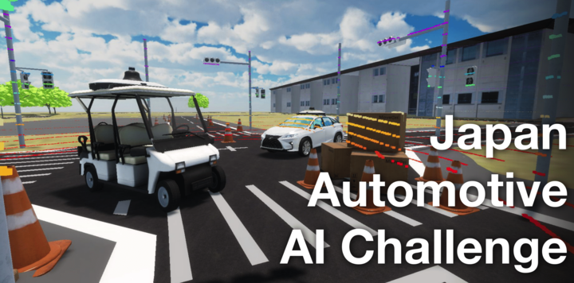
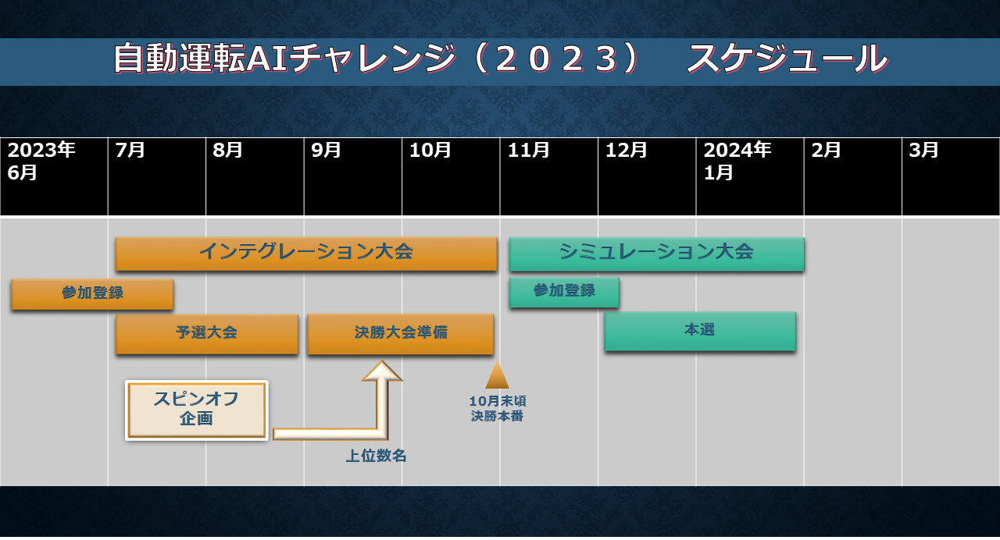
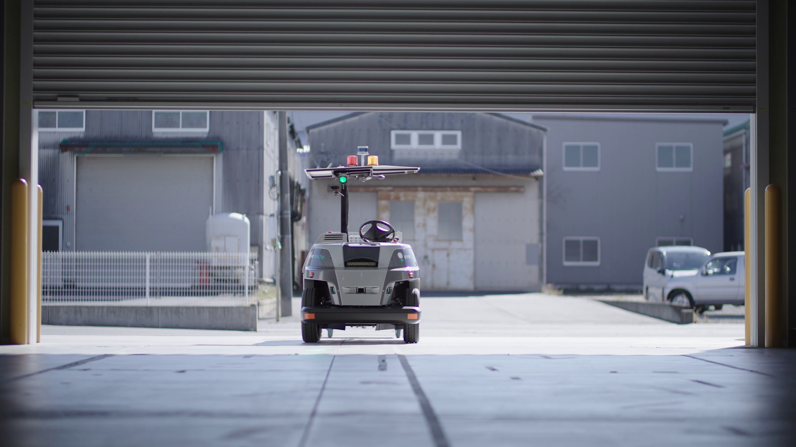

## 自動運転AIチャレンジ2023 インテグレーション大会

 

<!-- > [!REGISTER]
> こちらから参加登録!
> [https://www.jsae.or.jp/jaaic/en/index.php](https://www.jsae.or.jp/jaaic/en/index.php)

  -->

 

 

本ページは、2023年度の7月から10月にかけて実施される自動運転AIチャレンジ2023インテグレーション大会に関するページになります。

 

> [!Video https://www.youtube.com/embed/jfCjuWChvpo]

 
  
&emsp; 参加者の皆様には、Autoware.Universe をベースとした、自動運転ソフトウェアを開発していただきます。開発したソフトウェアをインテグレーションした自動運転車で、テーマに基づいた3つの課題をクリアし、 短い時間でコースを完走することが目標です。 

&emsp; 本大会は予選と本戦に分かれています。予選ではデジタルツインの自動運転シミュレーター AWSIM上で自動運転車を走行させ、本選では実際の車両で取得したデータをもとに、車両のチューニング、開発を行った後、リアルな環境に用意された予選と同様のコースに挑みます。  

 

  

## 大会コンセプト

CASEと呼ばれる新たな技術領域が自動車業界の競争の中心となる中、AIやITの技術者が不足しており、 自動車業界全体で急速に必要性が高まっています。
今後の自動車業界を牽引する技術者の発掘育成の為の新たな取り組みとして、自動運転におけるAI技術 を競う国際的な競技を開催します。
産官学が協力して行うこの競技を起点に、自動車産業のさらなる発展に寄与する枠組みの構築を目指します。

 

## チャレンジテーマ

工場内自動搬送で用いられる自動運転システムには、車両価格の低さと高いタスク処理能力の両立を求めら れます。それゆえに、限られたコンピューティングリソースとシンプルなセンサ構成の制約下で、安全性、 可用性、走破性をバランス良く達成することが課題です。  

 

  
  
### 安全性

人とロボットが協働する環境では、設備の影から現れる作業員との出会い頭の事故を防止すること、無作為 に通路上に置かれた残置物を発見し、確実かつ安全に停止することが求められます。  

 

  

### 可用性

石油化学プラントなどでは、地面近くに設置されたパイプから放出される蒸気が、センサーの視野を遮るこ とがあります。多様な環境下での走行には、蒸気、煙の存在する環境でも走行可能な認知システムが求められます。  

 

  

### 走破性

工場や倉庫の室内空間には、フォークリフトがぎりぎり通過できる程度の細い道や、設備機械や棚などの間 を縫う様に走る通路があります。そのため、複雑な細い道をスムーズに走行できる機能を開発する必要があります。  

 

  

> [!REGISTER]
> こちらから参加登録!
> [https://www.jsae.or.jp/jaaic/en/index.php](https://www.jsae.or.jp/jaaic/en/index.php)

 

## 本サイトについて
&emsp;本サイトには、インテグレーション大会の予選大会に関するルールや環境構築、参加方法などが記されております。
各ページをご確認のうえ、ご参加ください。  
 * [Introduction](./intro/index.html)  予選大会について
 * [Setup](./setup/index.html)  環境構築手順について
 * [Rule](./rule/index.html)  大会ルールについて
 * [LocalEnvrionment](./local/index.html)  ローカル環境について
 * [OnlineEnvrionment](./online/index.html)  オンライン環境について
 * [Customizing Autoware](./customize/index.html)  Autowareのカスタマイズについて
 * [FAQ](./FAQ/) About Frequently Asked Questions.
 * [Other](./other/index.html)  問い合わせ方法などについて
