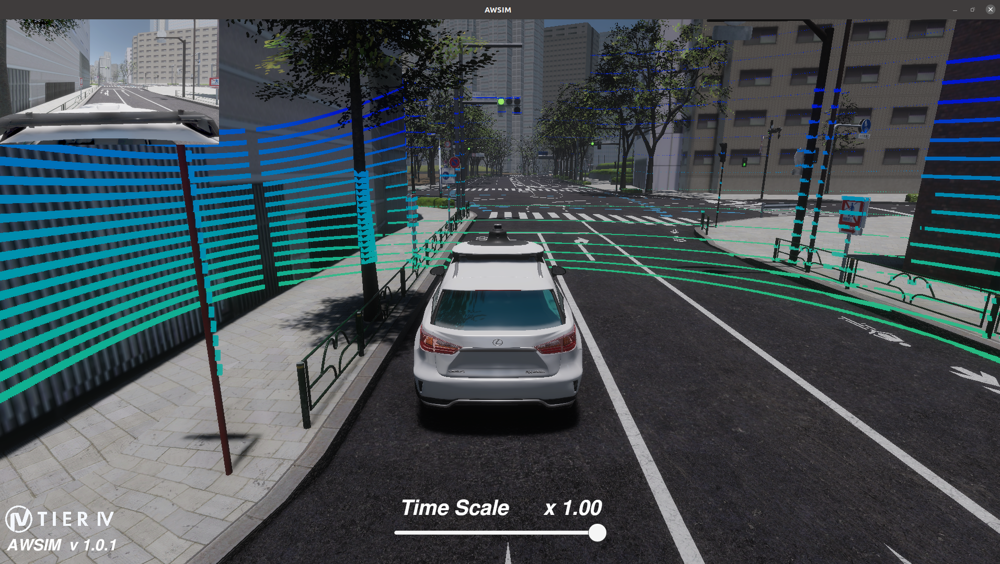

# AIチャレンジ2023インテグレーション大会 予選

 

<!-- > [!REGISTER]
> こちらから参加登録!
> [https://www.jsae.or.jp/jaaic/en/index.php](https://www.jsae.or.jp/jaaic/en/index.php)

  -->

## Introduction
&emsp;昨年度行った、自動運転AIチャレンジ2022シミュレーション大会と同様に、自動運転AIチャレンジ2023インテグレーション大会の予選大会では自動運転ソフトウェアAutoware.universeと自動運転シミュレータAWSIMを使用します。[Setupページ](../setup/index.html)記載の手順に沿って環境を構築し、大会へご参加ください。
  
## About Competition
&emsp;皆様には下記の流れに沿って、本大会に取り組んでいただきます。  
1. 与えられたシナリオをクリアできるようなソフトウェアをAutoware.universeをベースに開発  
2. ローカル環境で手順1で作成したソフトウェアを検証  
3. 検証が完了したソフトウェアをオンライン環境にアップロード  
4. オンライン上でシミュレーションが実施され、タイムを計測   
    ※最後にアップロードされたソースコードのシミュレーション結果のタイムに基づいて順位を決定します。
    （オンライン環境へのご案内は後日行います）  

## About Autoware
&emsp; AutowareとはROS2を使用したオープンソースの自動運転ソフトウェアです。LiDARやカメラなどからデータを取得するセンシング機能、センシングデータを組み合わせて車両の位置を推定するLocalization機能などがモジュールとして存在し、それらが相互に連携することで、自動運転を実現しています。本ソフトウェアは日本国内の公道での走行実験の実績もあります。  
&emsp; 本大会ではAutowareの中でも研究・開発向けディストリビューションであるAutoware.universeを使用します。その他のディストリビューションやAutowareのこれまでの開発の流れについては、[こちら](https://autowarefoundation.github.io/autoware-documentation/main/design/autoware-concepts/difference-from-ai-and-auto/)を御覧ください。
  
## About AWSIM
 &emsp;AWSIMはUnity上で動作するオープンソースの自動運転用シミュレータになります。ROS2 nativeに対応していること、WindowsやUbuntuに対応していることから、誰でも簡単に自動運転アルゴリズムのシミュレーションを行うことが可能です。
  &emsp;AutowareでAWSIMを活用した場合、AutowareのノードがAWSIMからセンシングデータをSubscribeし、受け取ったデータを各モジュールで処理を行い、その結果（車両制御情報）をAWSIMにPublishすることで、AWSIM上の車両を制御します。詳細は[こちら](https://github.com/tier4/AWSIM)をご確認ください。
 
 
## Related Documentations
 * [自動運転Aiチャレンジ公式HP](https://www.jsae.or.jp/jaaic/)
 * [Autoware.universe](https://github.com/autowarefoundation/autoware.universe)
 *  [AWSIM](https://github.com/tier4/AWSIM)
 
## Page Links
 * [Introduction](../intro/index.html)  予選大会について
 * [Setup](../setup/index.html)  環境構築手順について
 * [Rule](../rule/index.html)  大会ルールについて
 * [LocalEnvrionment](../local/index.html)  ローカル環境について
 * [OnlineEnvrionment](../online/index.html)  オンライン環境について
 * [Other](../other/index.html)  問い合わせ方法などについて
