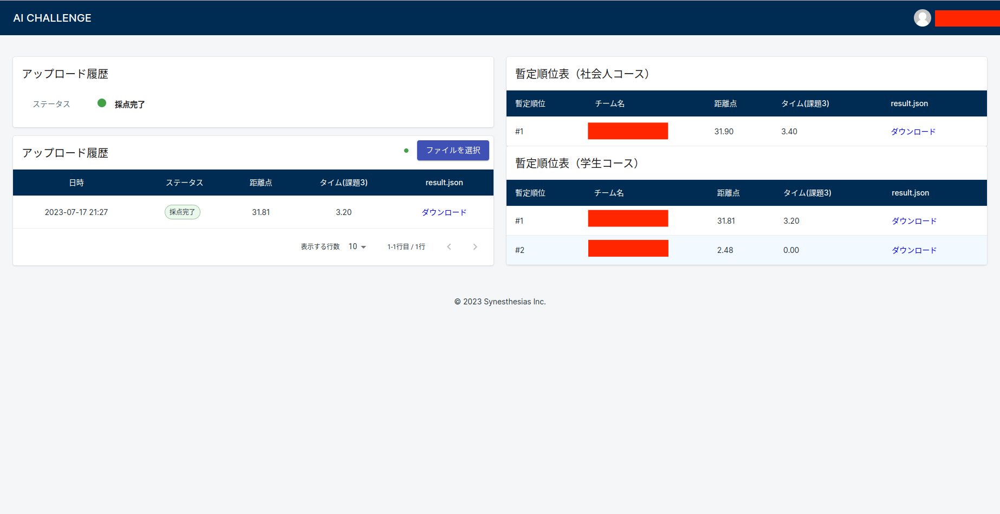

# Online Environment
<br>

<!-- > [!REGISTER]
> こちらから参加登録!
> [https://www.jsae.or.jp/jaaic/en/index.php](https://www.jsae.or.jp/jaaic/en/index.php)

<br> -->

 &emsp;本大会での採点は、シミュレータ・自動採点機能を備えたオンライン環境で行われます。  
 &emsp;下記手順を参考に、作成していただいたパッケージ群をオンライン環境にアップロードしてください。アップロード完了後、オンライン環境にてシミュレーションが開始され、結果が提示されます。
## Upload Procedure to Online Environment
1. 動作確認

   &emsp;`aichallenge_submit`のみアップロード可能なオンライン環境での動作を模した動作確認をお願いします。
   
   	1.  事前準備（`aichallenge_submit`の圧縮や結果出力用フォルダの生成）   	
   	```
	#aichallenge2023-simディレクトリで
	cd docker/evaluation
	bash advance_preparations.sh
	```
	2. dockerイメージのビルド
	```
	#aichallenge2023-sim/docker/evaluationディレクトリで
	bash build.sh
	```	
	3. AWSIMの起動
	4. dockerコンテナの起動（起動後、自動でautowareが立ち上がり、自動運転が開始されます）
	```
	#aichallenge2023-sim/docker/evaluationディレクトリで
	bash run_container.sh
	```	
	5. result.jsonの確認  
		評価完了後、outputフォルダにresult.jsonが格納されます。
2.  オンライン環境にアップロード    
	  
	 &emsp;[オンライン環境](https://aichallenge.synesthesias.jp)にアクセスし、手順1で作成した`aichallenge_submit.tar.gz`を「ファイルを選択」からアップロードしてください。アップロードが完了すると、ソースコードのビルド・シミュレーションの順番で実施されます。
	* 正常に終了した場合は、採点完了と表示され、result.jsonがダウンロードできるようになり、距離点・タイムがランキングに掲示されます。
	* シナリオ実行が終了しても、launchに失敗した等でスコアが出力されていない場合は「結果無し」となり、最終的なタイムとしては使われません。ローカルでは正常に動いているのにも関わらず「結果無し」と表示されてしまう場合サーバーサイドで内部エラーが生じている可能性があるため再度アップロードお願いします。繰り返し表示されてしまう場合はお問合せください。
	* ビルドに失敗した場合はビルド失敗が表示されます。再度、手順の確認をお願いします。
	* 採点プロセスは一度の提出で3回実行され、最高点が結果として使用されます。また、ランキングはそれまでの採点における最高点が適用されます。
	* 採点実行中は新たなソースのアップロードはできません。
	* アップロードできるのは1日3回までで、日本時間0時に回数はリセットされます。
   
4.  結果を確認  
	&emsp;オンライン環境にて評価が終わると、result.jsonがダウンロード可能になります。result.jsonをダウンロードし、結果を確認してください。

5.  結果なしの場合  
	1. packageの依存関係に問題がないか確認
	pythonで実装している場合はpackage.xmlに依存関係の漏れがないか,setup.pyまたはCMakeLists.txtが正しく記載されているかどうか、cppで実装している場合はpackage.xml, CMakeLists.txtが正しく記載されているかどうかご確認ください.
	2. dockerの確認
	`docker run -it aichallenge-eval:latest  /bin/bash`で確認できます。
	以下のディレクトリのaichallenge_wsに正しくinstall、buildされているか確認してください。
		```
		/aichallenge/aichallenge_ws/*
		/autoware/install/*
		```

