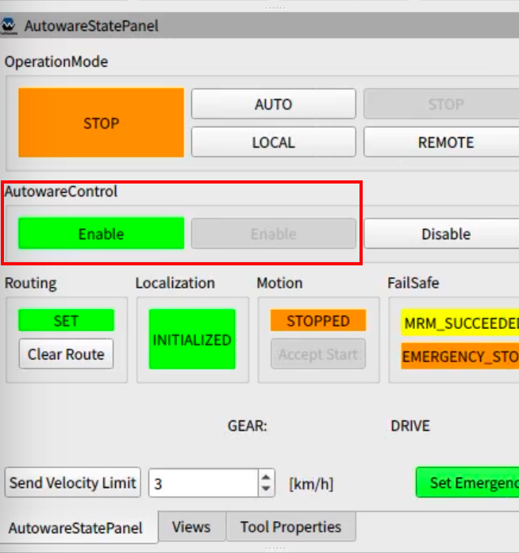
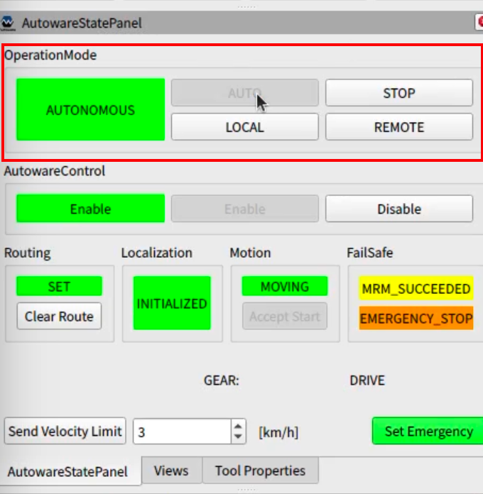

# Operation

&emsp;このページでは、 AutowareをインストールしたノートPCで競技車両(自動運転対応ゴルフカート、以下ゴルフカート)を動かす手順を解説します。

## Vehicle Interfaceの動作確認

本選で使用するゴルフカートのVehicle Interfaceの実行ファイルが競技に使用するPCの`~/vi_ws` の中に含まれています。このVehicle Interfaceを使用する方法を説明します。

1. シンボリックリンクを適用する。

    以下のコマンドを実行する。 //ToDo: レポジトリ名確認
    ```
    $ ln -snf /home/autoware/<開発に使用しているレポジトリ> /home/autoware/aichallenge2023final-test
    ```
2. Vehicle Interface の起動を確認する。

    `scripts/run_autoware_on_vehicle.sh` を実行後、別のターミナルで`ros2 node list |grep g30` を実行し、以下のように、Vehicle Interfaceのノード名が出力されることを確認する。

    ```
    $ ros2 node list |grep g30
    /g30esli/socket_can_receiver
    /g30esli/socket_can_sender
    /g30esli_interface
    /g30esli_interface_awiv_adapt_receiver
    /g30esli_interface_awiv_adapt_sender
    ```


## 車両HWとの接続方法

LiDARとCAN インターフェースとの接続設定手順を説明します。

### LiDARの接続

1. OS設定アプリ(`Settings`)から、Network設定メニューへ移動する。
2. Network設定画面内にある `Wired` の設定選択メニューから `velodyne` をクリックする。


### CAN インターフェースの接続

1. 車両前方にある Type-A USBケーブルをPCに接続する。
2. ターミナルを開き、`~/can_config.sh` を実行する。
3. `CAN Interface configuration done` と表示されることを確認する。

### LiDAR、CANインターフェース接続状態の確認

1. ターミナル上で `~/hw_connectivity_check.sh` を実行する。
2. `Connectivity check clear` と表示されることを確認する。

## 車両IDの設定

Autowareを実行するターミナルにて、 環境変数 `VEHICLE_ID` を設定する。
```
例)
$ export VEHICLE_ID=3 # VEHICLE_IDは競技当日メンターから提示されます。
```

## 自動運転発進までの手順

**※車両を動かす前に必ず [安全に関する注意点](#安全に関する注意点)を一読ください。**

1. (競技参加者)ターミナルを開き、以下のコマンドを実行してAutowareを起動する。
    ```
    $ source /opt/ros/humble/setup.bash
    $ source <開発レポジトリのルート>install/setup.bash
    $ cd scripts
    $ ./run_autoware_on_vehicle.sh
    ```

2. (競技参加者)自己位置推定を開始する。
   1. 2D pose estimate をrVizから入力する。
   2. `AutowareStatePanel` の `Localization`の表示が`INITIALIZED`となっていることを確認する。
   

3. (競技参加者)ゴール地点を指定する。
   1. ターミナルを開き、`<開発レポジトリのルート>/scripts/set_goal.sh`を実行してゴール地点を設定する。
   2. ゴールに向かう経路が引かれていることをrVizで確認する。

4. (セーフティドライバー)ゴルフカートのモードを`自動モード`に設定する。

5. (競技参加者)Autowareによる車両制御を有効化する。
   1. メンターの指示を受け、`AutowareStatePanel`の`AutowareControl`の`Enable`ボタンをクリックする。
   2. `AutowareStatePanel`の`AutowareControl`の表示が`Enable`になっていることを確認する。
   

6. (セーフティードライバー) ステアの挙動を確認し、ゴルフカードがAutowareの制御を正常に受け付けていることを確認し、Autowareの自動運転モード許可を参加者に伝達する。

7. (競技参加者)Autowareを自動運転モードに設定する。
   1. セーフティドライバーに「自動運転開始します」と発話する。
   2. `AutowareStatePanel`の`OperationMode`の`AUTO`ボタンをクリックする。
   3. `AutowareStatePanel`の`OperationMode`の表示が`AUTONOMOUS`になっていることを確認する。
   

### オーバーライド（ドライバーが車両を停止させたとき）が発生した場合

1. (セーフティドライバー) オーバーライドした旨を競技参加者に伝達する。
2. メンターの指示を受け、`AutowareStatePanel`の`AutowareControl`の`Disable`ボタンをクリックする。
3. `AutowareStatePanel`の`AutowareControl`の表示が`Disable`になっていることを確認する。

## 安全に関する注意点

- HWの接続不良などが原因で、自動運転モードへの切り替えに失敗することがあります。自動運転モードへの切り替え失敗はセーフティドライバーが判断します。本事象が発生した場合は、メンターの指示に従い自動運転発進までの手順をやり直してください。
- 自動走行時、車両に同乗しない参加者は歩道上で待機してください。経路上や車両周囲は立ち入り禁止です。
- 自動走行時は必ず上部の手すりを掴んでください。
- 自動運転に使用するノートPCをバンドで固定してください。 キーボードが打ちづらい場合は貸出しているUSB無線キーボードを使用してください。
