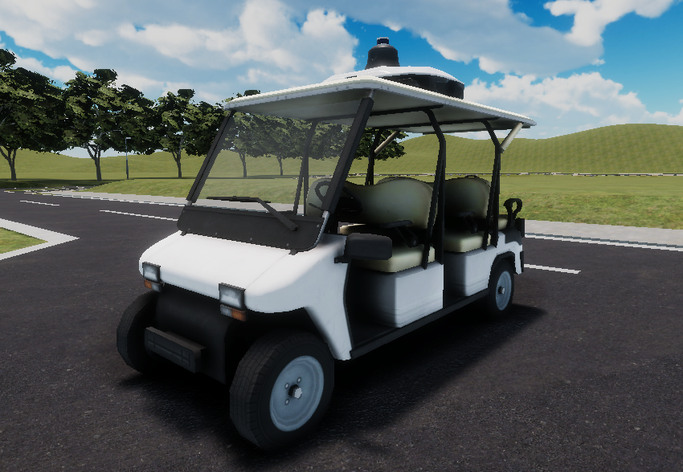
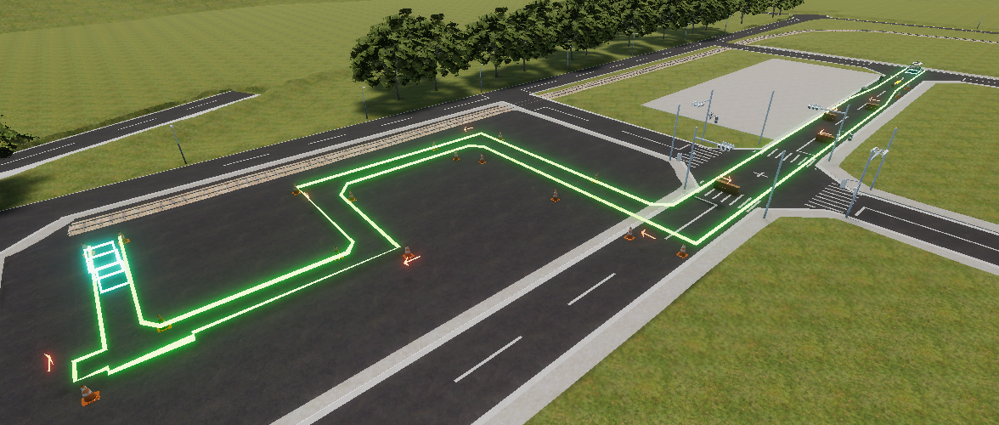
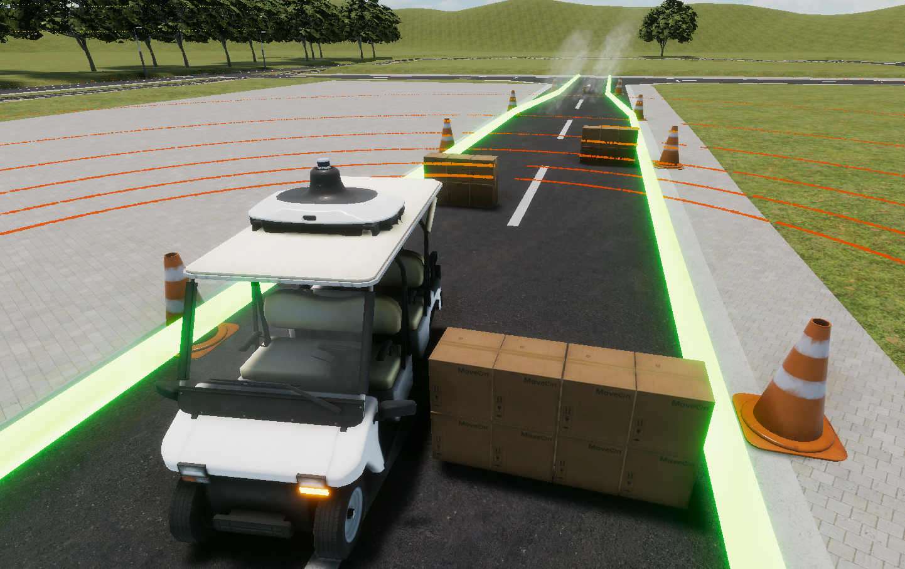

# Rule

<br>

<!-- > [!REGISTER]
> こちらから参加登録!
> [https://www.jsae.or.jp/jaaic/en/index.php](https://www.jsae.or.jp/jaaic/en/index.php)

<br> -->

&emsp;参加者の皆様が開発した自動運転ソフトウェアを用いて自動運転車両を走行させ、その結果から算出される`距離点`で競い合っていただきます。  
&emsp;競技の詳細やコースの仕様などについては、下記をご参照ください。

## Detail of Rule
### Ranking System
* 順位は距離点によって決定されます。  
`距離点: min(スタート地点からの全体の走行距離 (m), コース全体の距離) * (1.0 - 課題1ペナルティ - 課題2ペナルティ - 課題3ペナルティ)`
* 距離点が同じ場合、課題3エリアでの走行時間が最も短い競技者を上位とします（課題の最後まで走行した場合）。

### Regulation
- 走行速度は0~5km/h
- 制限速度を2km/h以上超えた場合失格＝０点
- 制限時間は5分（ルートの途中で走行停止してしまった場合に対応するため）
- 車両が発進してからの時間を計測
- 配置・経路は多少ランダムになる可能性あり
- ゴールした後に衝突した際の処理の追記が必要
- 決勝大会での走行時に危険が伴うため、あらかじめ経路を設定して決め打ちで走行するようなアルゴリズムにはしないでください。
- 提出されたコード内容は審査時に確認する可能性があります。
- 採点処理に影響するコード等、意図的な不正が発覚した場合失格とみなします。

## Vehicle
使用する車両はこちらのゴルフカートです。
  

## Course   
3つの課題が用意されたこちらのコースに挑戦していただきます。
  

###  Task 1 : Obstacle detection stop (cardboard)
クリア条件:     
&emsp;・車頭が障害物から3mから6mの間の位置で停車すること    
ペナルティ:     
&emsp;・停車できなかった場合、距離点から5%減点    
  

### Task 2: Driving in the presence of smoke  
クリア条件:  
&emsp;・課題2の区間内で停車しないこと    
ペナルティ:    
&emsp;・停車した場合、距離点から5%減点    
  

### Task 3-1: Narrow road driving (slalom）
クリア条件：      
&emsp;・ダンボールに衝突しないこと    
&emsp;・指定の経路からはみ出さないこと     
ペナルティ：     
&emsp;・ダンボールに衝突、または指定の経路からはみ出すと走行終了


### Task 3-2: Narrow road driving (L-shaped crank)  
クリア条件：      
&emsp;・指定の経路からはみ出さないこと    
ペナルティ：    
&emsp;・指定の経路からはみ出すと走行終了    


### Task 3-3 Stop after reaching the goal
クリア条件：      
&emsp;・ゴール地点の青い枠まで完走後、停止すること。
&emsp;・完走した後で経路からはみ出した場合、5%減点      


### How to check results
&emsp;走行が完了すると、`/aichallenge/scoreトピック`と`/aichallenge/collisionトピック`に基づき`result.json`が出力されます。下記を参照のうえ、結果をご確認ください。  
```
{
  "rawDistanceScore": float32, // ペナルティ入っていない距離点
  "distanceScore": float32, // ランキングに反映される距離点
  "task3Duration": float32, // タスク3にかかった時間
  "isOutsideLane": bool, // レーンはみだし
  "isTimeout": bool, // 時間切れ
  "hasCollided": bool, // 衝突
  "hasExceededSpeedLimit": bool, // 制限速度超過
  "hasFinishedTask1": bool, // タスク1を成功したか
  "hasFinishedTask2": bool, // タスク2を成功したか
  "hasFinishedTask3": bool // タスク3を成功したか
}
```
