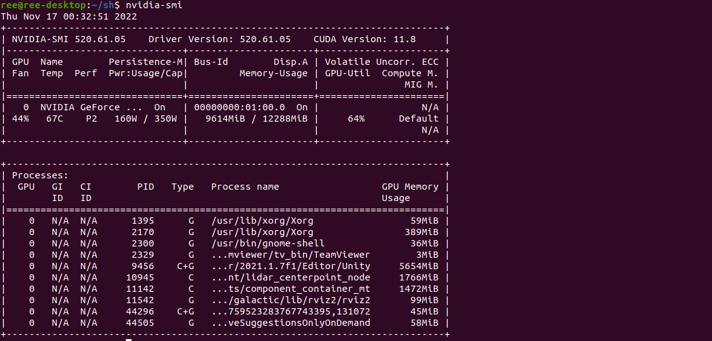
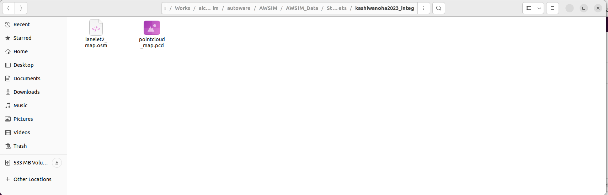
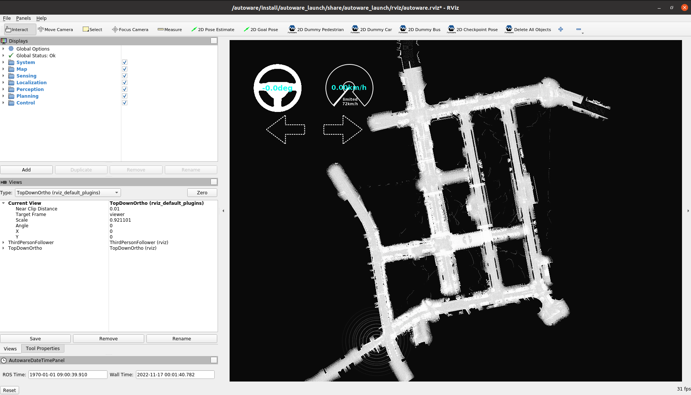
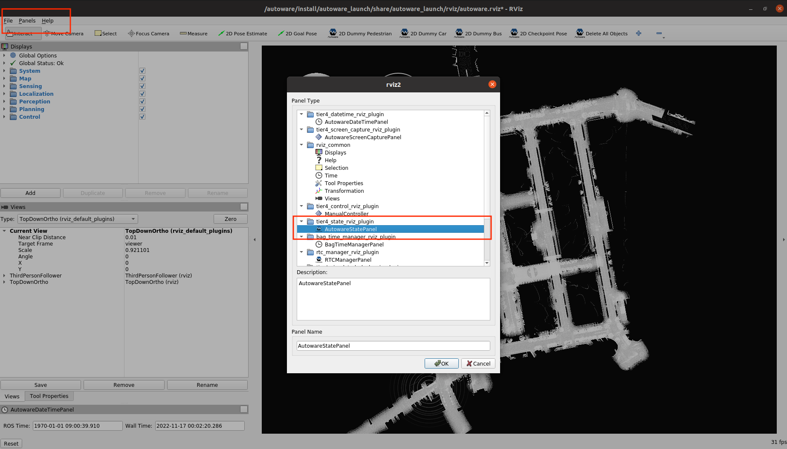
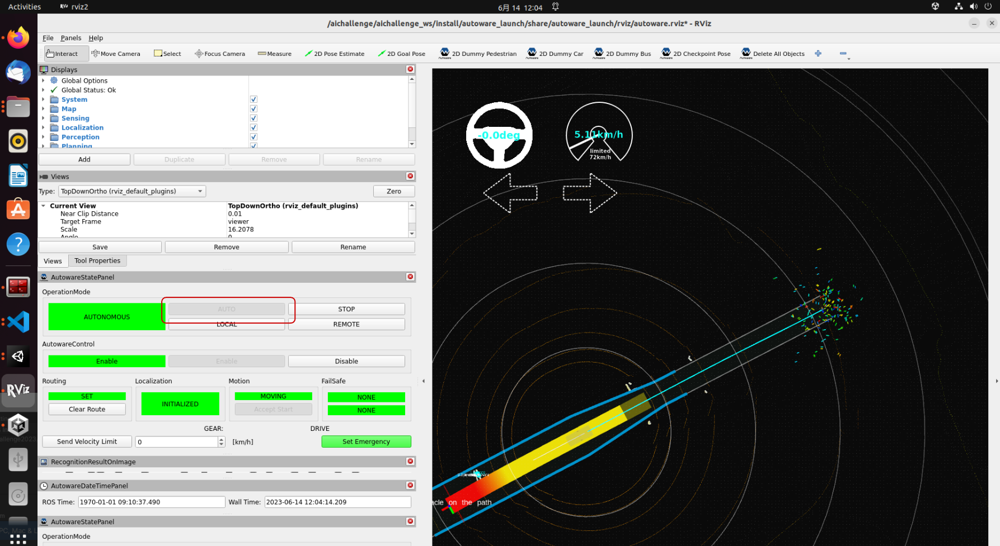

# SetUp

## Minimum Hardware Requirements
本大会で使用していただくPCの動作環境として以下を推奨しております。

* OS: Ubuntu 22.04
* CPU: Intel Corei7 (8 cores) or higher
* GPU: NVIDIA Geforce RTX 3080 (VRAM 12 GB) or higher
* Memory: 32 GB or more
* Storage: SSD 30 GB or higher

上記のスペックを満たすPCをご用意できない方は、下記の「PC2台で参加する方向け」のスペックをご参照ください。
#### 2台のPCを使用する方向け
#### Autoware PC
* OS: Ubuntu 22.04
* CPU: Intel Corei7 (8 cores) or higher
* GPU: NVIDIA Geforce GTX 1080 or higher
* Memory: 16 GB or higher
* Storage: SSD 10 GB or higher
* 詳細は[こちら](https://autowarefoundation.github.io/autoware-documentation/main/installation/)

#### AWSIM PC
* OS: Ubuntu 22.04 or Windows 10/11
* CPU: Intel Corei7 (6 cores and 12 threads) or higher
* GPU: NVIDIA Geforce RTX 2080 Ti or higher
* 詳細は[こちら](https://tier4.github.io/AWSIM/)

※Autoware動作PCとAWSIM動作PCは、同じネットワーク内に配置してください。
配置できていれば、基本的には追加設定をすることなく、PC間のトピック通信は可能です。万が一、トピック通信ができなかった場合はファイアーウォールの解除、もしくはルールの見直しをお願いします。
  
    
## Environment Setup
### AWSIM(Ubuntu)
#### 事前準備
* Nvidiaドライバのインストール
  1. リポジトリの追加
  ```
  sudo add-apt-repository ppa:graphics-drivers/ppa
  ```
  2. パッケージリストの更新
  ```
  sudo apt update
  ```
  3. インストール
  ```
  sudo ubuntu-drivers autoinstall
  ```
  4. 再起動の後、下記コマンドを実行し、インストールできていることを確認
  ```
  nvidia-smi
  ```
  
 
 * Vulkunのインストール
    1. パッケージリストの更新
    ```
    sudo apt update
    ```
    2. libvulkan1をインストール
    ```
    sudo apt install libvulkan1
    ```
 * コースの準備
   1. 大会用の実行ファイルを[ダウンロード](https://drive.google.com/file/d/1aduBKhYGI0mhhRbgu4B05pBTyFXcZsGN/view?usp=sharing)し、解凍
   ※チュートリアル用
   3. パーミッションを図のように変更    
     
   3. ファイルをダブルクリックで起動
   4. 下記のような画面が表示されることを確認
      

### Dockerの事前準備  
下記のインストールをお願いします。
  * [docker](https://docs.docker.com/engine/install/ubuntu/)
  * [rocker](https://github.com/osrf/rocker) 
     * Dockerコンテナ内のRviz、rqtなどのGUIを使用するために用います。
  * [Nvidia Container Toolkit](https://docs.nvidia.com/datacenter/cloud-native/container-toolkit/install-guide.html)
  * [git lfs](https://packagecloud.io/github/git-lfs/install)
  * [ROS2](https://docs.ros.org/en/humble/index.html) (動画確認済バージョン: Humble)
  
* Dockerイメージの準備・起動 〜 Autowareの準備
   1. Dockerイメージを入手
    ```
   docker pull ghcr.io/automotiveaichallenge/aichallenge2023-sim/autoware-universe-cuda:v1
    ```
    ※上記の方法では長時間かかってしまう方・タイムアウトしてしまう方↓  
　[こちら](https://drive.google.com/file/d/1mOEpiN36UPe70NqiibloDcd_ewgMr_5P/view?usp=sharing)に、イメージをtarにまとめたものを置きましたので、下記コマンドよりご利用ください
   ```
   docker load < autoware-universe-cuda_v1.tar.gz
   ```
    2. 大会用データのダウンロード
    ```
    sudo apt install -y git-lfs
    git lfs clone https://github.com/AutomotiveAIChallenge/aichallenge2023-sim
    ```
    3. rockerを起動
    ```
    cd ./aichallenge2023-sim
    rocker --nvidia --x11 --user --net host --privileged --volume autoware:/aichallenge -- ghcr.io/automotiveaichallenge/aichallenge2023-sim/autoware-universe-cuda:v1
    ```

#### Dockerコンテナ内でのAWSIM起動
DockerコンテナからAWSIMを起動したい場合は、Dockerイメージの準備手順(前述)に従ってDockerイメージを導入した後、以下の手順で行ってください。
  1. `aichallenge2023-sim/autoware`内に大会用AWSIM実行ファイルを展開(以下、`aichallenge2023-sim/autoware/AWSIM/AWSIM.x86_64`に配置されているものとします。)
  2. rockerを起動 (`docker container ls` でdocker が存在していることを確認してください）
   ```
    cd ./aichallenge2023-sim
    rocker --nvidia --x11 --user --net host --privileged --volume autoware:/aichallenge -- ghcr.io/automotiveaichallenge/aichallenge2023-sim/autoware-universe-cuda:v1
   ```
  3. コンテナ内で以下を実行
   ```
    export ROS_LOCALHOST_ONLY=1
    export RMW_IMPLEMENTATION=rmw_cyclonedds_cpp
    export RCUTILS_COLORIZED_OUTPUT=1
    sudo ip link set multicast on lo
    source /autoware/install/setup.bash
    /aichallenge/AWSIM/AWSIM.x86_64
   ```

### AWSIM(Windows)
  1. 大会用の実行ファイルを[ダウンロード](https://drive.google.com/file/d/1L6jr9wttxA2aLl8IqC3xDXIuQUfjMTAJ/view?usp=sharing)し、解凍
  ※チュートリアル用
  2. ファイルをダブルクリックで起動
  3. 下記のような画面が表示されることを確認
    

### 地図データ(pcd, osm)のコピー



地図データはAWSIMの圧縮ファイル内に格納されています。`AWSIM_Data/StreamingAssets/kashiwanoha2023_integ`に配置されているosmファイルとpcdファイルを`aichallenge2023-sim/autoware/mapfile`にコピーして、ファイル構成が以下になるように配置してください。
```
aichallenge2023-sim
└ autoware
 └ mapfile
  ├ .gitkeep
  ├ lanelet2_map.osm
  └ pointcloud_map.pcd
```

### Autoware      
 * Autowareの動作確認  
   AWSIMを用いて、Autowareの動作確認を行う方法を記します。
   1. AWSIMを起動
   2. Autowareを起動
   ```
   # Rockerコンテナ内で
   export ROS_LOCALHOST_ONLY=1
   export RMW_IMPLEMENTATION=rmw_cyclonedds_cpp
   export RCUTILS_COLORIZED_OUTPUT=1
   sudo ip link set multicast on lo
   cd /aichallenge/aichallenge_ws
   colcon build --symlink-install --cmake-args -DCMAKE_BUILD_TYPE=Release
   source install/setup.bash
   ros2 launch autoware_launch e2e_simulator.launch.xml vehicle_model:=golfcart sensor_model:=awsim_sensor_kit map_path:=/aichallenge/mapfile
   ```
   3. 下記のような画面(Rviz2)が表示されることを確認  
      
     
   4. 自己位置推定ができていることを確認。正しく推定できていなければ、タブにある2D Pose Estimateを選択し、実際の車両の位置をドラッグで指定  
       
            
   5. タブにある2D Goal Poseを選択し、ゴールポジションをドラッグで指定。画像のように、ルートが表示されている かつ `Routing`が`UNSET`から`SET`に変わっていることを確認（指定してから少し時間がかかります）  
              
       
   6. `OperationMode`の`AUTO`ボタンを押下し、自動運転が開始されることを確認  
        
        
