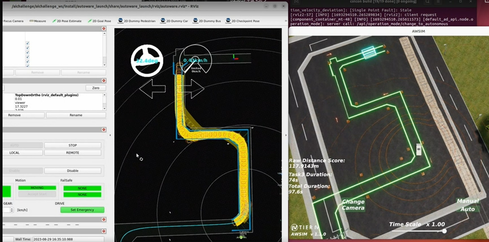
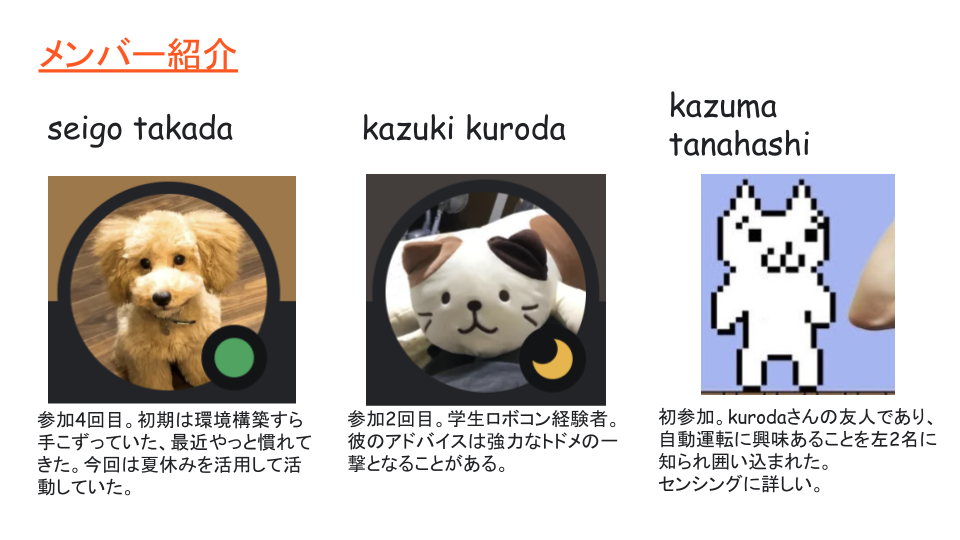
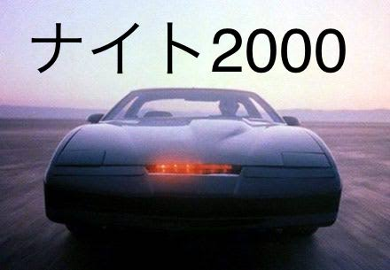
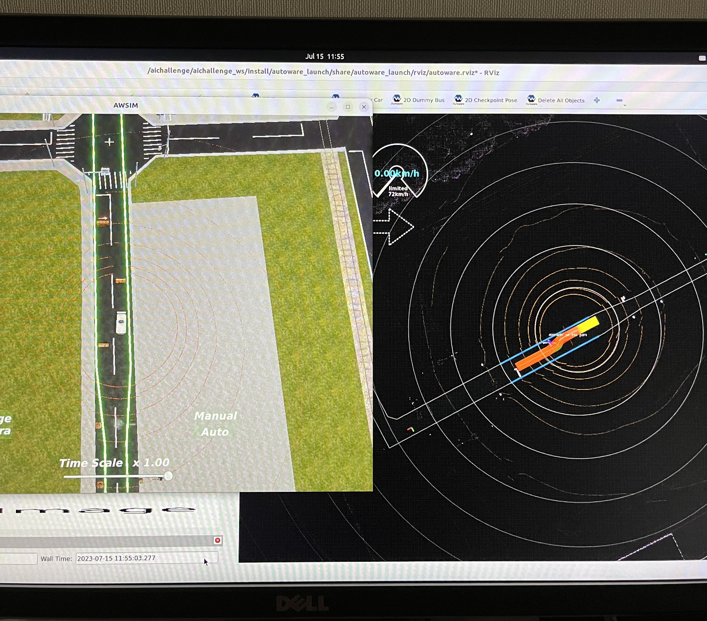
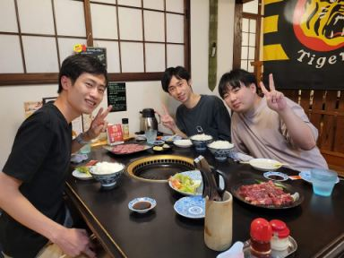
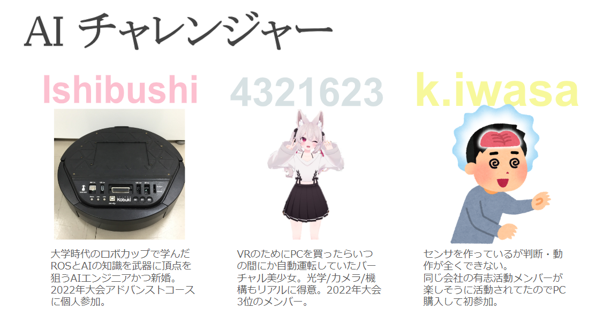

# Teams

 

本ページでは、予選大会に参加したチームの紹介を行います！

 

---

## ひでちゅん(43)

 

**紹介文：** 大会中に無事４４歳になりました。

**工夫した点：** とりあえずやってみる。

 

---

## norikenpi

 

**紹介文：** 海苔と芋けんぴが好きです！1人チームですががんばります！

**工夫した点：** ドキュメントをしっかり読みました！

 

  

---

## PC高かった

 

**紹介文：** 元電機屋勤務で今はフリーの技術屋（自称）です。昨年末、自技会メルマガでAIチャレンジを知り参加する際、要求specを満たすPCを組んだらお高くついたので… 

**工夫した点：** まずはautowareの通信データ(topic)を見たかったのですがrvizの使い方がわからないので、MATLABで簡単なビュアー[添付ファイル]を作ってみました（ROS toolboxがないのでtopic echoでデータ取得していましたが、扱いやすいように加工する方が大変でした）。

 

<video width="500" controls>
  <source src="../images/teams/video1.webm" type="video/webm">
</video>

  

---

## Team123

 

**紹介文：** マイペースな性格でのんびり好きなことをやりたいということで今回は一人での参加をしました！
学部時代に自動運転のプロジェクトに携わったことがあるものの、当時はすでにほぼ完成していたものを動かすだけだったのでナビゲーションなどをいじって自分で開発できる大会に魅力を感じて参加しました。

**工夫した点：** ポテンシャル法を用いた障害物回避モジュールを自作しました。Autowareの既存のプランナーは良くも悪くも完成されているため、初心者の私がいじるにはハードルが高かったため1から自分のプランナーを作ろうと思いました。同じような境遇の人の助けになればなという思いで初心者が本大会に挑戦する記録をQiitaに投稿したりしました。

 

---

## Team I.D.E.A.

 

**Introduction：** We are a team from SRM, India. We are from Automobile department third year, we  are interested on autonomous vehicles and have worked on a couple projects related to the same. Mainly two of us worked on the aichallenge this year.

**Team Tactics：** We focused on avoidance especially task 3.

---

## チーム遊戯王

 

**紹介文：** 企業の有志活動メンバー３名で構成されるチームです。過去に自動運転AIチャレンジに４回ほど参加したことがあります。楽しむ事をモットーに取り組んでいます。 
有志活動: https://challenge-club.connpass.com/

**工夫した点：** 環境構築や走行性能向上に苦労しました。競技においては特に第3クランクの突破のためにplanner活用など各種工夫を試みました。チームワークで課題解決にとりくんでいきます。

 

  

---

## 厚木の小雨

 

**紹介文：**  
1人チームです。（少し寂しいですが）  
自動運転と賢くて優しいAIに憧れています。小学生の頃、大好きだった米ドラマ「ナイトライダー」で登場した完全自動運転車ナイト2000が会話できることに感動しました。それが現実に近づいてきていることにとても喜んでいます。  
Autoware、ROS、Deep Learningの初心者です。  
出身は中国、2011年に来日し、現在は日本国内の自動車メーカーで部品の品質改善に携わっています。  
私のような初心者が、自動運転に興味を持ち、実際の開発に関わることは難しいですが、この機会は非常にありがたいと思っています。  
心から感謝しています。  

**工夫した点：**
苦労したこと：  
* Linuxがクラッシュした…  
* ROS2のインストールがうまくいかなかった  
* コンテナの使い方がわからなかった  
* Autoware-Miniのpathが更新されなかった  
* プログラミングスキルが不足しており、Autowareのチューニングに取り組みましたが、望ましい方法でのチューニングができませんでした。Autowareのドキュメントや有志者様のブログ記事を読みましたが、分からないことが多く、システムも複雑で、論理的な計画が立てられませんでした。試行錯誤を繰り返し、最適な解決策を探しました。  

 

  

  

---

## iASL

 

**紹介文：** 岐阜大学アレックス研究室のB4メンバー3人で挑戦しています！

**工夫した点：** Autowareの調整を行うにあたり、毎回発生する起動・タスクキルを自動化する数行のスクリプトを書きました。またAutowareのドキュメントを読み込みました。

 

  

---

## AIチャレンジャー

 

**紹介文：** 同じ会社の有志活動のチームです。（有志活動：https://challenge-club.connpass.com/ ）  

**工夫した点：** 環境構築や評価の効率化。Discordでの多拠点同期デバッグ。Ishibushi氏と学ぶ経路生成。  

 

  
