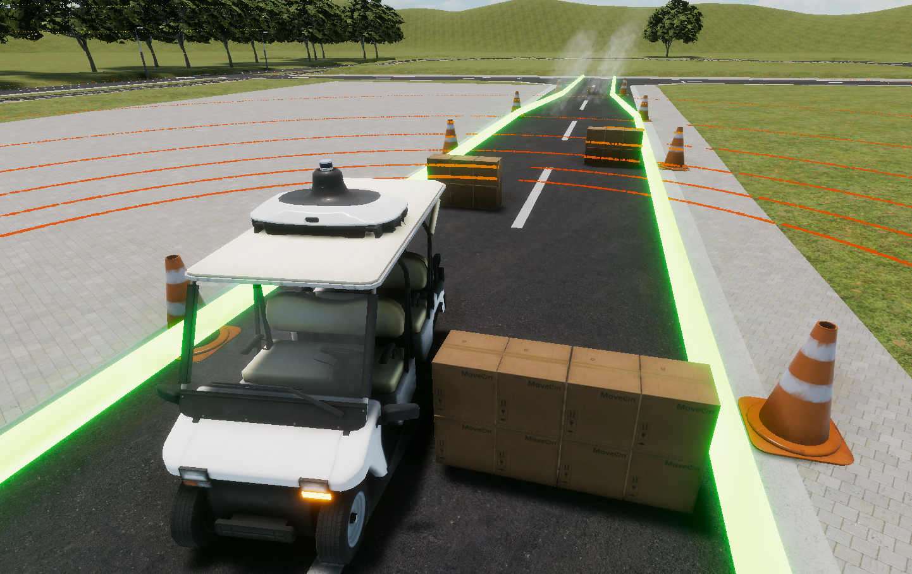

## Japan Automotive AI Challenge 2023 Integration Competition

 

<!-- > [!REGISTER]
> Register from here!
> [https://www.jsae.or.jp/jaaic/en/index.php](https://www.jsae.or.jp/jaaic/en/index.php)

  -->

 

This is the official documentation for the **Japan Automotive AI Challenge 2023 Integration Competition**, which will be held from July to October 2023.  

 

> [!Video https://www.youtube.com/embed/jfCjuWChvpo]

 

The main objective of the competition is to implement autonomous driving software based on the [open-source Autoware stack](https://github.com/autowarefoundation/autoware), and complete driving tasks in a simulation-based environment and a real-life environment.

The competition is divided into the **Preliminary Round** and the **Finals**. 

In the **Preliminary Round**, contestants will test their autonomous driving software in a simualation environment based on [AWSIM, a digital twin self-driving simulator](https://github.com/tier4/AWSIM). Teams with the best scores can then proceed to the Finals, which will take place at the Autonomous Driving Test Field in the University of Tokyo Kashiwa Campus, Japan.

In the **Finals**, contestants will tune and further improve their autonomous driving software based on data obtained from actual vehicles, and then take on a course similar to the simulation environment in the Preliminary Round. But this time, they will be able to integrate their software into actual vehicles and see everything come into action in real life!

  

## Schedule

This competition is the **Integration Competition** in the figure below.

The schedule is as follows:

|  | Dates |
| --- | --- |
| Registration | June 5th, 2023 to July 14th, 2023 |
| Preliminary Round | July 3rd, 2023 to August 31st, 2023 |
| Finals | November 12th, 2023 (Planned) |

  

## Who can join?

- Anyone can participate. Participation fee is free.
- Participation is per team (up to 3 people; a team of 1 person is also possible).

 

> [!REGISTER]
> Register from here!
> [https://www.jsae.or.jp/jaaic/en/index.php](https://www.jsae.or.jp/jaaic/en/index.php)

 

## Concept of the Competition

While a new technological area called CASE is at the center of competition in the automotive industry, there is a shortage of AI and IT engineers, and the need for them is rapidly increasing throughout the automotive industry.
As a new initiative to discover and nurture engineers who will lead the automotive industry in the future, we will hold an international competition for AI technology in automated driving.
The aim is to build a framework that will contribute to the further development of the automotive industry, starting with this competition, in which industry, government, and academia will cooperate.

 

## Themes of the Competition
The automated driving systems used in automated factory conveyance are required to have both low vehicle cost and high task processing capability. Therefore, the challenge is to achieve a good balance between safety, availability, and drivability under the constraints of limited computing resources and simple sensor configurations.

  

### Safety
In an environment where humans and robots work together, it is necessary to prevent accidents during encounters with workers emerging from the shadows of equipment, and to detect and reliably and safely stop leftover objects placed randomly on the walkway.  

  

### Availability
In petrochemical plants, for example, vapors released from pipes installed close to the ground can block the view of sensors. Driving in diverse environments requires a cognitive system that can drive in environments where steam and smoke are present.  

  

### Drivability
In the interior spaces of factories and warehouses, there are narrow paths that a forklift can barely pass through, as well as aisles that run between equipment and shelves. Therefore, it is necessary to develop a function that can smoothly travel along complicated narrow paths.  

  

## Competition Tasks

 

In order to address the themes of the competition mentioned above, there are several tasks that your autonomous driving software must tackle.

The tasks include stopping before a small obstacle, maneuvering through narrow S-curves, and driving through tight L-cranks.

For more specifics on the course and the rules, check the [Rules Page](./rule)

 

 

  

  

## About this site

This website contains the rules, environment construction, and participation procedures for the preliminary round of the Integration Competition.
Please check each page before participating.  

 * [Introduction](./intro) About the Qualifying Competition
 * [Setup](./setup) Setup procedure
 * [Rule](./rule) About the rules of the tournament
 * [LocalEnvrionment](./local) About local environment
 * [OnlineEnvrionment](./online) About online environment
 * [Customizing Autoware](./customize/) About customizing Autoware
 * [FAQ](./FAQ/) About Frequently Asked Questions.
 * [Other](./other) How to contact us, etc.
