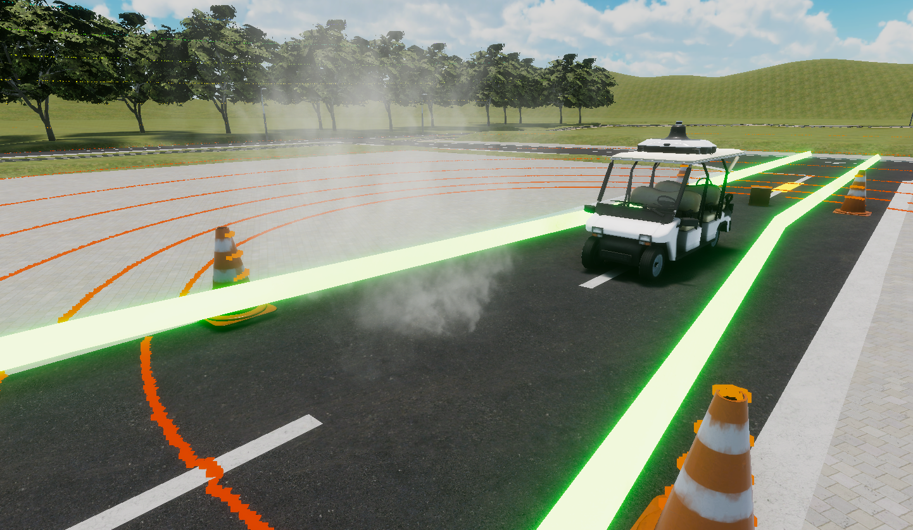

# Rule

<br>

<!-- > [!REGISTER]
> Register from here!
> [https://www.jsae.or.jp/jaaic/en/index.php](https://www.jsae.or.jp/jaaic/en/index.php)


<br> -->

&emsp;Participants will drive an automated vehicle using the automated driving software they have developed, and compete in terms of `distance points` calculated from the results.  
For details of the competition and course specifications, please refer to the following.

## Detail of Rule
### Ranking System
* Rankings are determined by distance points.  
`Distance points: min(overall distance from the starting point (m), distance of the entire course) * (1.0 - assignment 1 penalty - assignment 2 penalty - assignment 3 penalty)`.
* If the distance points are the same, the Competitor with the shortest running time in the Task 3 area will be placed higher (if he/she runs to the end of the task).

### Regulation
- Travel speed is 0~5km/h
- If the speed limit is exceeded by more than 2km/h, the competitor will be disqualified = 0 points.
- Time limit is 5 minutes (to accommodate the case where the vehicle stops in the middle of the route).
- Time from when the vehicle starts is measured.
- Placement and route may be somewhat random
- Need to add a handling of collision after reaching the goal.
- Please do not use an algorithm that sets up a route in advance and runs in a deterministic manner, as this may be dangerous when running in the finals.
- The contents of the submitted code may be checked during the judging.
- Any code that affects the scoring process or any other intentional irregularity that is discovered will be disqualified.

## Vehicle
The vehicle to be used is the golf cart shown here.
  

## Course   
You will be challenged with 3 tasks in this course.
  

### Task 1 : Obstacle detection stop (cardboard)
Clear condition:   
&emsp;・Obstacle detection stop (cardboard)       
&emsp;・The vehicle head must stop at a position between 3m and 6m from the obstacle.      
Penalty:   
&emsp;・the vehicle head must be between 3m and 6m from the obstacle.      
&emsp;・If the vehicle fails to stop, 5% points will be deducted from the distance points.    
  

### Task 2: Driving in the presence of smoke  
Clear condition:   
&emsp; ・Do not stop within the section of Task 2.    
Penalty:   
&emsp;・Do not stop within the section of Task 2.    
&emsp;・If you stop, 5% points will be deducted from the distance points.    
  

### Task 3-1: Narrow road driving (slalom)
Clear condition:     
&emsp;・Do not collide with a cardboard box.      
&emsp;・Do not stray from the designated route.       
Penalty:   
&emsp;・If the vehicle collides with a cardboard box or strays from the designated path, the driving will be terminated.      


### Task 3-2: Narrow road driving (L-shaped crank)  
Clear condition:      
&emsp;・Do not stray from the designated route.      
Penalty:      
&emsp;・If you run out of the designated path, the race will be terminated.      


### Task 3-3: Stop after reaching the goal
Clear condition:      
&emsp;・Stop when you reach the goal at blue-framed area.      
Penalty:      
&emsp;・Going out of the path(Couldn't stop at the goal) after finishing the race, 5% point deduction will be given.      


### How to check results
&emsp; When the run is completed, `result.json` will be output based on `/aichallenge/score topic` and `/aichallenge/collision topic`. See below to check the results.  
```
{
  "rawDistanceScore": float32, // distance points without penalty
  "distanceScore": float32, // distance points reflected in the ranking
  "task3Duration": float32, // time spent on task 3
  "isOutsideLane": bool, // lane outside lane
  "isTimeout": bool, // timeout
  "hasCollided": bool, // collision
  "hasExceededSpeedLimit": bool, // speed limit exceeded
  "hasFinishedTask1": bool, // has Task 1 been completed successfully
  "hasFinishedTask2": bool, // has Task 2 been completed successfully
  "hasFinishedTask3": bool // has Task 3 been completed successfully?
}
````
