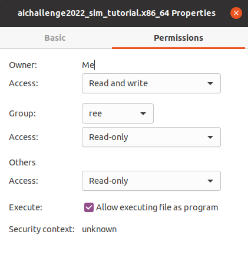
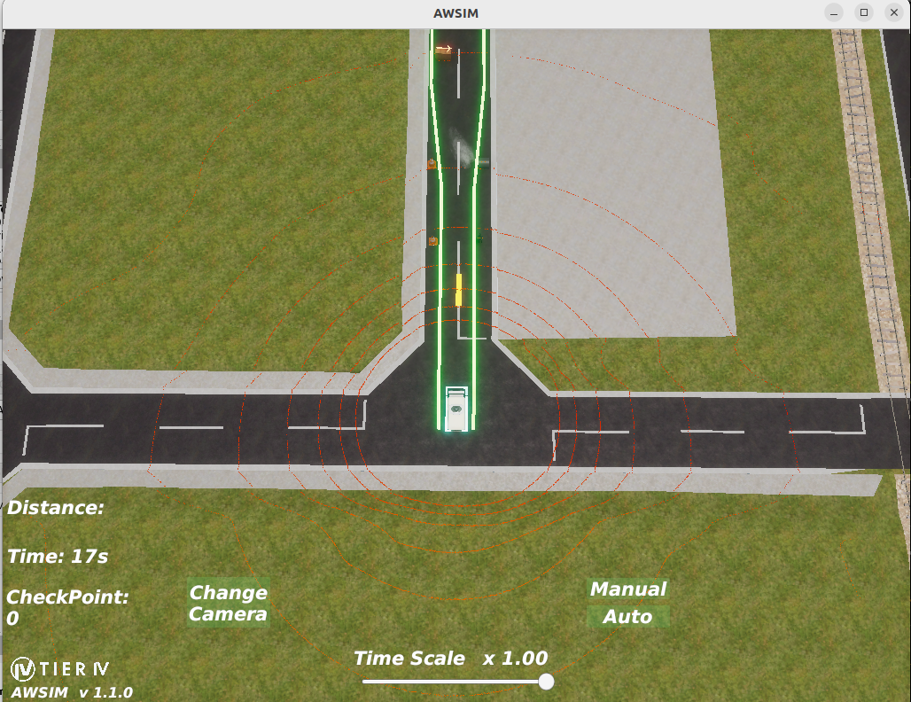
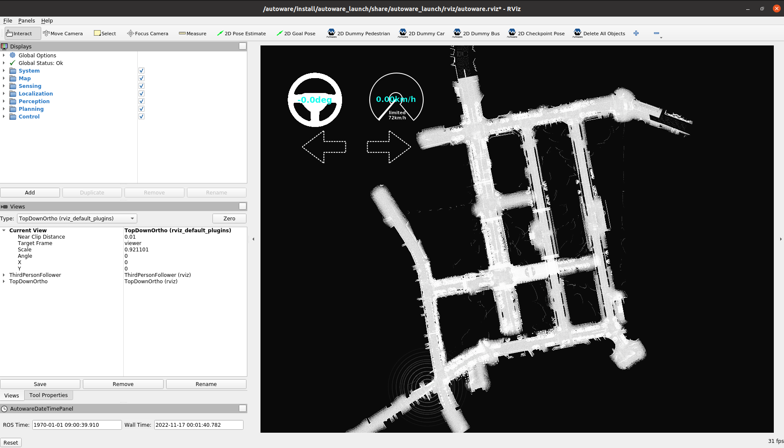
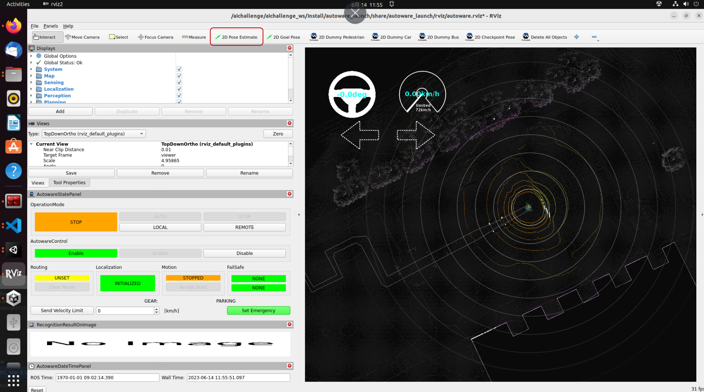
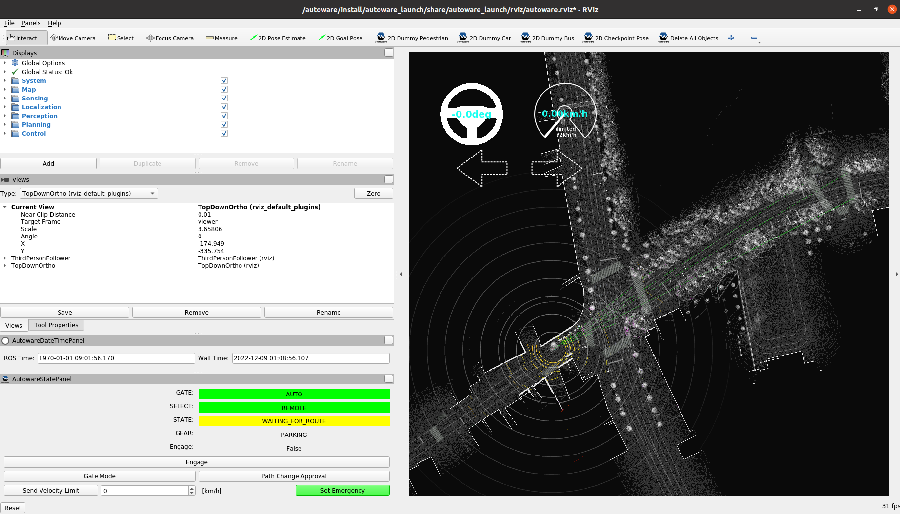

## SetUp


## Minimum Hardware Requirements
We recommend the following PC operating environment for this tournament.


* OS: Ubuntu 22.04
* CPU: Intel Corei7 (8 cores) or higher
* GPU: NVIDIA Geforce RTX 3080 (VRAM 12 GB) or higher
* Memory: 32 GB or more
* Storage: SSD 30 GB or higher


If you are unable to prepare a PC that meets the above specifications, please refer to the "For participants with two PCs" below.
#### For participants with two PCs
#### Autoware PC
* OS: Ubuntu 22.04
* CPU: Intel Corei7 (8 cores) or higher
* GPU: NVIDIA Geforce GTX 1080 or higher
* Memory: 16 GB or higher
* Storage: SSD 10 GB or higher
* For more information [here](https://autowarefoundation.github.io/autoware-documentation/main/installation/)


#### AWSIM PC
* OS: Ubuntu 22.04 or Windows 10/11
* CPU: Intel Corei7 (6 cores and 12 threads) or higher
* GPU: NVIDIA Geforce RTX 2080 Ti or higher
* For more information [click here](https://tier4.github.io/AWSIM/)


Autoware and AWSIM PCs should be located in the same network.
If they are located in the same network, topic communication between PCs is basically possible without any additional settings. In the unlikely event that topic communication is not possible, please disable the firewall or review the rules.
  
    
## Environment Setup
### AWSIM(Ubuntu)
#### Preparation
* Install Nvidia drivers
  1. add repository
  ```
  sudo add-apt-repository ppa:graphics-drivers/ppa
  ```
  2. update package list
  ```
  sudo apt update
  ```
  3. install 
  ```
  sudo ubuntu-drivers autoinstall
  ```
  4. After rebooting, run the following command to confirm that the installation has completed.
  ```
  nvidia-smi
  ```
  
 
 * Install Vulkun
    1. update package list
    ```
    sudo apt update
    ```
    2. install libvulkan1
    ```
    sudo apt install libvulkan1
    ```
 * Prepare the course
   1. [Download](https://drive.google.com/file/d/1aduBKhYGI0mhhRbgu4B05pBTyFXcZsGN/view?usp=sharing) the executable file for the competition and unzip it    
   ※Tutorial Environment
   3. change permissions as shown in the figure    
     
   Double-click the file to launch it.
   4. confirm that the following screen is displayed
      
        
#### Starting AWSIM in a Docker container
If you want to start AWSIM from a Docker container, please follow the steps below after installing a Docker image according to the Docker image preparation procedure (see below).
  1. extract the executable file for the convention in `aichallenge2023-sim/autoware` (Hereinafter, it is assumed to be located in `aichallenge2023-sim/autoware/AWSIM/AWSIM.x86_64`)
  2. launch the Docker container
   ```
    cd aichallenge2023-sim
    rocker --nvidia --x11 --user --net host --privileged --volume autoware:/aichallenge -- ghcr.io/automotiveaichallenge/aichallenge2023-sim/ autoware-universe-cuda:v1
   ```
  3. execute the following in the container
   ```
    export ROS_LOCALHOST_ONLY=1
    export RMW_IMPLEMENTATION=rmw_cyclonedds_cpp
    export RCUTILS_COLORIZED_OUTPUT=1
    source /autoware/install/setup.bash
    /aichallenge/AWSIM/AWSIM.x86_64
   ```

### AWSIM(Windows)
  1. [Download](https://drive.google.com/file/d/1L6jr9wttxA2aLl8IqC3xDXIuQUfjMTAJ/view?usp=sharing) the executable file for the convention and unzip it.   
  ※Tutorial Environment
  3. double-click the file to start it
  Confirm that the following screen is displayed.
    

### Copy map data (pcd, osm)


Map data is stored in AWSIM compressed files. Copy the osm and pcd files located in `AWSIM_Data/StreamingAssets/kashiwanoha2023_integ` to `aichallenge2023-sim/autoware/mapfile` and arrange them so that the file structure is as follows:
```
aichallenge2023-sim
└ autoware
 └ mapfile
  ├ .gitkeep
  ├ lanelet2_map.osm
  └ pointcloud_map.pcd
```

### Autoware
Docker image of Autoware (using CUDA) is available for this competition.
  
* Preparation  
Please install the following.
  * [docker](https://docs.docker.com/engine/install/ubuntu/)
  * [rocker](https://github.com/osrf/rocker) 
     * [docker](https://docs.docker.com/engine/install/ubuntu/) * [rocker](https://github.com/osrf/rocker) is used to use GUI such as Rviz and rqt in Docker container.
  * [Nvidia Container Toolkit](https://docs.nvidia.com/datacenter/cloud-native/container-toolkit/install-guide.html)
  * [git lfs](https://packagecloud.io/github/git-lfs/install)
  * [ROS2](https://docs.ros.org/en/humble/index.html) (video confirmed version: Humble)
  
* Prepare and launch Docker image - Prepare Autoware
   1. get a Docker image
    ```
   docker pull ghcr.io/automotiveaichallenge/aichallenge2023-sim/autoware-universe-cuda:v1
    ```
    If the above method takes a long time or times out, you can use the following method.  
　We have placed a tarball of the image at [here](https://drive.google.com/file/d/1mOEpiN36UPe70NqiibloDcd_ewgMr_5P/view?usp=sharing). Please use the following command
   ```
   docker load < autoware-universe-cuda_v1.tar.gz
   ``` 
    2. download the data for the competition
    ```
    sudo apt install -y git-lfs
    git lfs clone https://github.com/AutomotiveAIChallenge/aichallenge2023-sim
    ```
    3. start rocker
    ```
    cd . /aichallenge2023-sim
    rocker --nvidia --x11 --user --net host --privileged --volume autoware:/aichallenge -- ghcr.io/automotiveaichallenge/aichallenge2023-sim/ autoware-universe-cuda:v1
    ```
      
 * Verify Autoware operation  
   This section describes how to check the operation of Autoware using AWSIM. 
   1. Start AWSIM. 
   2. Start Autoware.
   ```
   # In the Rocker container
   export ROS_LOCALHOST_ONLY=1
   export RMW_IMPLEMENTATION=rmw_cyclonedds_cpp
   export RCUTILS_COLORIZED_OUTPUT=1
   cd /aichallenge/aichallenge_ws
   colcon build 
   source install/setup.bash
   cd /aichallenge
   ros2 launch autoware_launch e2e_simulator.launch.xml vehicle_model:=golfcart sensor_model:=awsim_sensor_kit map_path:=/aichallenge/mapfile
   ```
   3. Confirm that the following screen (Rviz2) is displayed.  
      
     
   4. Confirm that self-position estimation is done. If it is not estimated correctly, select `2D Pose Estimate` in the tab and drag the actual position of the vehicle.
      
      
   5. Select the `2D Goal Pose` in the `Goal Pose` tab and drag to specify the goal position. Confirm that the route is displayed and `Routing` changes from `UNSET` to `SET` as shown in the image (it takes a little time after you specify it). 
             
       
   6. Press the `AUTO` button in `OperationMode` and confirm that self driving is started.
    
