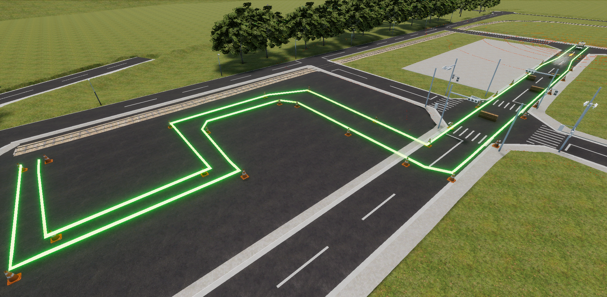

# Rule
本競技は、自動走行車両の走行結果から算出されるスコアをオンライン上のシミュレータで競うものです。

## Driving Vehicle
自動走行を行う車両にはゴルフカートを使用します。
  

## Scenario
  皆様に挑んでいただくコースはこちらです。
  
### 課題1 障害物検知停止 (ダンボール)
クリア条件: 障害物をの手前で停車すること  
ペナルティ: 停車できなかった場合、距離点からX%割引
  
### 課題2 煙の存在する環境下での走行
クリア条件: 煙の影響により停車しないこと    
ペナルティ: 停車した場合は 距離点からY%割引
  
### 課題3 狭路走行 (S字カーブ、L字クランク)
クリア条件: 設置物に衝突しないことに加え、指定の経路からはみ出さずに完走すること  
ペナルティ: 設置物に衝突する、または指定の経路からはみ出したら走行終了
  
  
## Detail of Rule  
### Rank-determination Rules
*  距離点に応じて順位を決定  
*距離点 = スタート地点からの全体の走行距離 (m) * (1.0 - 課題1ペナルティ - 課題2ペナル ティ)*
* 距離点が同じ場合は課題3エリアの走行時間が短い方が上位(最後まで走破した場合)

### Limitation
* 走行速度は0~5km/h
* 制限速度を2km/h以上超えた場合失格＝０点
* 配置は多少ランダムになる可能性あり

### Confirmation of time
```
# Rockerコンテナ内で
source /aichallenge/aichallenge_ws/install/setup.bash
ros2 topic echo /score/result
# ゴール判定または失格時に以下のように表示されます。
# score: 164699
# has_finished: true
# has_collided: false
# has_park_failed: false
# check_point_count: 2
# `score`の値が最終タイムです。
# `has_finished`がfalseの場合失格です。
```